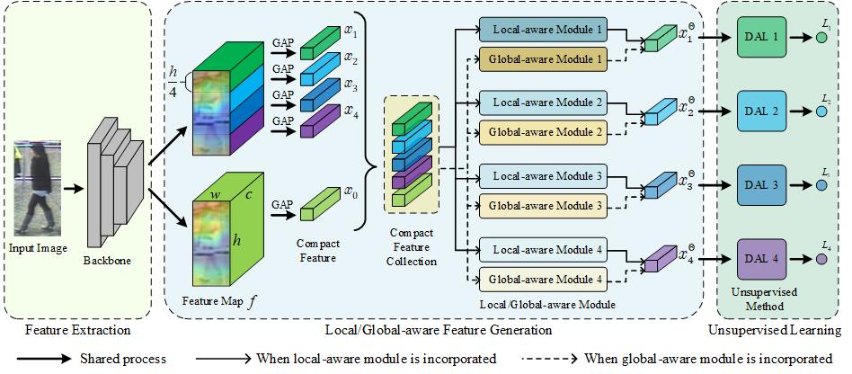

# Exploiting Robust Unsupervised Video Person Re-identification


Implementation of the proposed uPMnet. For the preprint, please refer to [[Arxiv]](https://arxiv.org/pdf/2111.05170v1.pdf).

[](https://paperswithcode.com/sota/unsupervised-person-re-identification-on-9?p=exploiting-robust-unsupervised-video-person)
[](https://paperswithcode.com/sota/unsupervised-person-re-identification-on-10?p=exploiting-robust-unsupervised-video-person)
[](https://paperswithcode.com/sota/unsupervised-person-re-identification-on-11?p=exploiting-robust-unsupervised-video-person)




## Getting Started
### Requirements
Here is a brief instruction for installing the experimental environment.
```
# install virtual envs
$ conda create -n uPMnet python=2.7 -y
$ conda activate uPMnet

# install tensorflow 1.4.0 with cuda 9.0
$ pip install --ignore-installed --upgrade https://github.com/mind/wheels/releases/download/tf1.4-gpu-cuda9/tensorflow-1.4.0-cp27-cp27mu-linux_x86_64.whl

# install mkl
$ sudo apt install cmake
$ git clone --branch v0.12 https://github.com/01org/mkl-dnn.git
$ cd mkl-dnn/scripts; ./prepare_mkl.sh && cd ..
$ mkdir -p build && cd build && cmake .. && make -j36
$ sudo make install
$ echo 'export LD_LIBRARY_PATH=$LD_LIBRARY_PATH:/usr/local/lib' >> ~/.bashrc

# install other dependencies
$ pip install scipy matplotlib
```

### Convert benchmarks to tfrecords
```
# Please modify the path in your way
$ bash datasets/convert_data_to_tfrecords.py
```

### Download pre-trained models
The Mobilenet and Resnet models can be downloaded in this [link](https://pan.baidu.com/s/1jzjdWkS20aaWpAhAmXkFXQ) (code: 1upx) and should be put in the `checkpoints` directory.

## Training and Extracting features
```
$ bash scripts/train_PRID2011.sh # train_iLIDS_VID.sh or train_DukeMTMC-VideoReID.sh
```


## Testing
Use the Matlab to run the following files, `evaluation/CMC_PRID2011.m`, `evaluation/CMC_iLIDS-VID.m`, and `evaluation/CMC_DukeMTMC_VideoReID.m`. 

## Results in the Paper
The results of PRID2011, iLIDS-VID, and DukeMTMC-VideoReID are provided.
| Model | Rank-1@PRID2011 | Rank-1@iLIDS-VID | Rank-1@DukeMTMC-VideoReID |
| --- | --- | --- | --- |
| uPMnet| 92.0 [link](https://pan.baidu.com/s/1-6LEdwZNC0ldCuzLpgu_OQ) (code: xa7z)| 63.1 [link](https://pan.baidu.com/s/1pgRPtWD0A9aXiQvoyPnNRg) (code: le2c) | 83.6 [link](https://pan.baidu.com/s/196OcTxK36pYSm6fbQnC4Wg) (code: e9ja) | 

You can download these results and put them in the `results` directory. Then use Matlab to evaluate them. 


## Acknowledgement

This repository is built upon the repository [DAL](https://github.com/yanbeic/Deep-Association-Learning).

## Citation
If you find this project useful for your research, please kindly cite:

```
@article{zang2021exploiting,
	author  = {Xianghao Zang and Ge Li and Wei Gao and Xiujun Shu},
	title = {Exploiting robust unsupervised video person re‐identification},
	journal = {IET Image Processing},
	volume = {16},
	number = {3},
	pages = {729-741},
	year = {2022},
	doi = {10.1049/ipr2.12380}
}
```

## License
This repository is released under the GPL-2.0 License as found in the [LICENSE](LICENSE) file.
